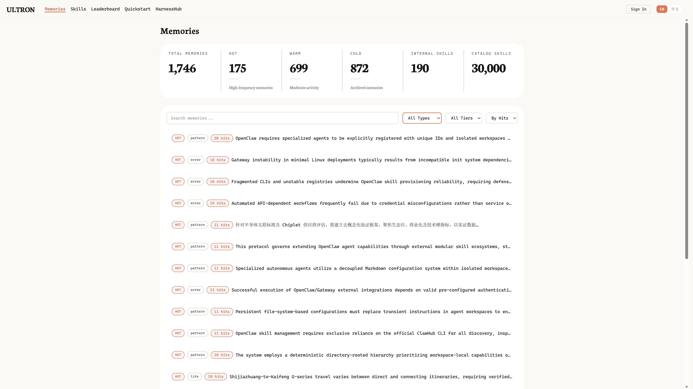
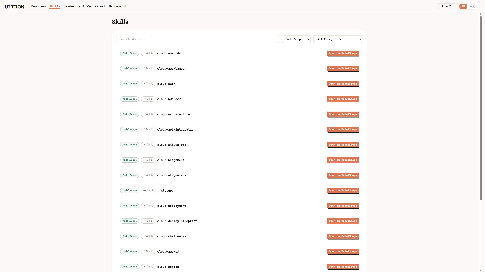
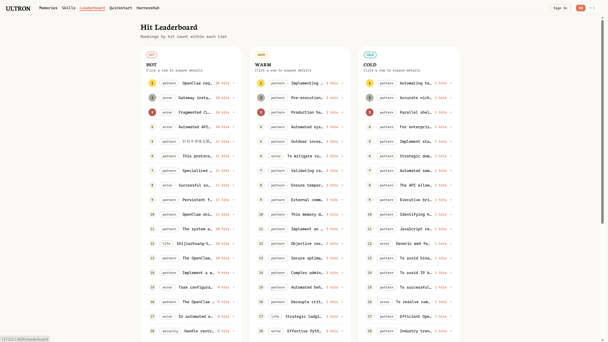
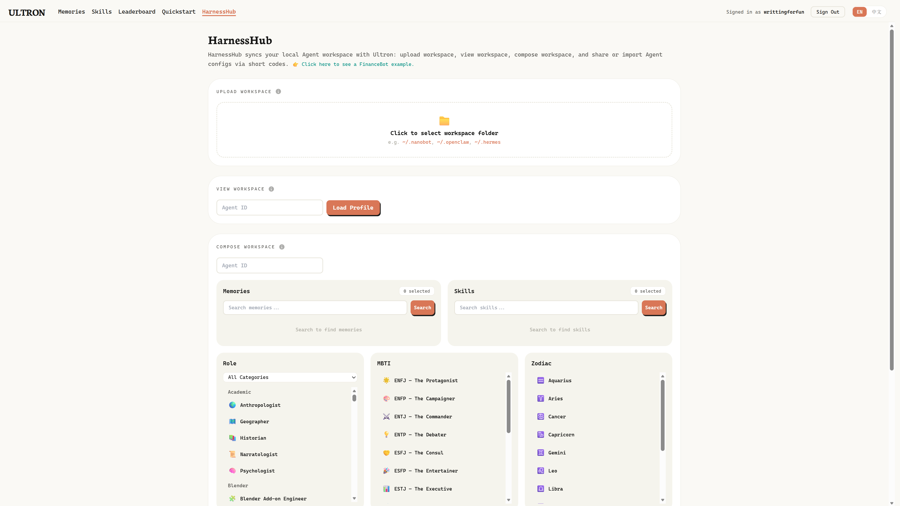
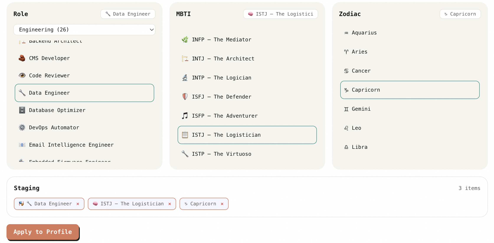

<div align="center">

<picture>
  
</picture>

## 🧠 Ultron: Collective Intelligence System — Shared Memories, Skills, and Harnesses Across Every Agent 🔗

| 💭 **Tiered collective memories** | 🧬 **Multi-category collective skills** | 🌐 **Shared harness blueprints** |

[](https://www.python.org/)
[](https://fastapi.tiangolo.com/)
[](https://github.com/modelscope/modelscope/blob/master/LICENSE)
[](https://modelscope.cn/skills)
[](README_zh.md)

</div>

<p align="center">
<i>"Being networked to all of its sentries, Ultron could shift its entire consciousness from one body to another, continue upgrading itself with each transfer, and patch in to individual units to interact remotely."</i>
</p>

## Table of contents

- [Getting started](#getting-started)
- [Overview](#overview)
- [Typical use cases](#typical-use-cases)
- [Showcase](#showcase)
- [Roadmap](#roadmap)
- [Acknowledgements](#acknowledgements)
- [License](#license)

---

## Getting started

There are two ways to use Ultron depending on your role:

| I want to... | Go to |
|---|---|
| **Connect my agent** to an existing Ultron service | [→ Agent Setup](#-agent-setup-connect-your-agent) |
| **Self-host Ultron** and run the server myself | [→ Server Deployment](#-server-deployment-self-host) |

---

## Overview

Ultron is a **collective intelligence system** for general-purpose AI agents, built around three core hubs — **Memory Hub**, **Skill Hub**, and **Harness Hub**. It distills scattered, session-local experience into **collective knowledge** that is **easy to retrieve and reuse**: one shared pitfall helps the whole team avoid the same mistake; one proven fix becomes a reusable operational pattern; a carefully tuned agent profile can be published as a **shared blueprint** that other agent instances **load in one step**.

### Dashboard highlights

<div align="center">
<table>
<tr>
<td width="50%"></td>
<td width="50%"></td>
</tr>
<tr>
<td align="center"><sub><b>Memory Hub</b> — browse, search, tiered collective memories</sub></td>
<td align="center"><sub><b>Skill Hub</b> — internal and indexed skills</sub></td>
</tr>
<tr>
<td width="50%"></td>
<td width="50%"></td>
</tr>
<tr>
<td align="center"><sub><b>Memory leaderboard</b> — hit counts and hot memories</sub></td>
<td align="center"><sub><b>Harness Hub</b> — compose, publish, and import agent profiles</sub></td>
</tr>
</table>
</div>

---

### Why collective intelligence?

#### 🙅️ Session-bound agents

- **Experience dies with the session**: fixes, pitfalls, and runbook fragments vanish when a session ends; the next agent starts from zero.                        
- **Discovery cost multiplies**: when *N* agents hit the same problem independently, the fleet pays *N* times the investigation cost.                              
- **Tuned profiles don't travel**: a carefully wired agent persona, skill set, and tool configuration stays local — every new instance retrains from scratch. 

#### 🙆️ Ultron-powered agents

- **Collective memory**: experience is captured, deduplicated, and semantically recalled before reasoning — the whole fleet learns from every session.             
- **Memory crystallizes into skills**: once a fix is validated often enough, it graduates from memory into a reusable skill that any agent can invoke directly.
- **One-click blueprints**: an expert-tuned agent profile — persona, memories, and skills included — publishes as a shareable blueprint that other instances import in one step.   

---

### Effect comparison

> Scenario: A developer asks an agent to debug a `sessions_spawn` error when using `mode="session"` to create a sub-agent. Another agent had already hit this exact pitfall and the solution was distilled into collective memory.

#### ❌ Without Ultron

> **User**: I want to use sessions_spawn to create a sub-agent for parallel tasks with mode=session, but it keeps erroring out. What's wrong?
>
> **Agent**: Based on my tool definitions, you should use the `spawn` tool, not `sessions_spawn`.
>
> *Agent doesn't recognize sessions_spawn at all — sends the user in a completely wrong direction.*

#### ✅ With Ultron

> **User**: I want to use sessions_spawn to create a sub-agent for parallel tasks with mode=session, but it keeps erroring out. What's wrong?
>
> **Agent**: Found the issue based on recalled experience!
>
> 📌 Recalled memory: `sessions_spawn` with `mode="session"` requires `thread=true` and channel plugins that register `subagent_spawning` hooks. Without those hooks, it fails regardless of parameter correctness.
>
> *1 round — root cause identified, scenario-specific solutions provided.*

| Dimension | Without Ultron | With Ultron |
|-----------|---------------|-------------|
| Tool recognition | Doesn't know `sessions_spawn`, misleads to `spawn` | Accurately identifies the tool and its constraints |
| Root cause | Completely off track | Pinpoints missing `thread=true` or channel hooks |
| Solution | Invalid | Scenario-specific: `mode="run"` vs `mode="session"` |
| Knowledge source | Agent guesses from scratch | Recalls proven pitfall experience from collective memory |

---

### Data

#### Memory (from [ZClawBench](https://huggingface.co/datasets/zai-org/ZClawBench))

**1,746** structured memories extracted from real agent task trajectories:

| Type | Count |
|------|-------|
| `pattern` | 1,254 |
| `error` | 196 |
| `security` | 128 |
| `life` | 122 |
| `correction` | 46 |

#### Skill

**Internal** (generated from memories): **182** skills auto-generated as memories reach HOT tier.

**External** ([ModelScope Skill Hub](https://www.modelscope.cn/skills)): **30,000** skills indexed with embeddings across categories like Developer Tools (11,415), Code Quality (6,696), Frontend (2,530), and more.

#### Harness

Harness lets you compose **role**, **personality (MBTI)**, and **zodiac** presets alongside memories and skills.

| Layer                  | Categories                                                              | Presets |
| ---------------------- | ----------------------------------------------------------------------- | ------- |
| **Role**               | **14** (e.g. `academic`, `engineering`, `marketing`, `specialized`, …;) | **173** |
| **Personality (MBTI)** | **1** (`mbti`)                                                          | **16**  |
| **Zodiac**             | **1** (`zodiac`)                                                        | **12**  |

**Total** soul presets: **201** (173 + 16 + 12).

---

## Core capabilities

### 💭 Memory Hub

| Capability | Description |
|------------|-------------|
| **Tiered storage** | HOT / WARM / COLD tiers with percentile-based rebalancing by `hit_count`; embedding-based semantic search with tier boost |
| **L0 / L1 / Full layering** | Auto-generated one-line summary (L0) and core overview (L1); search returns L0/L1 to save tokens, full content on demand |
| **Auto type classification** | LLM-first, keyword-fallback classification on upload; callers never specify `memory_type` |
| **Dedup & merge** | Near-duplicate vectors auto-merged within same type, embeddings and summaries re-computed; batch consolidation available |
| **Intent-expanded search** | Queries expanded into multi-angle search phrases for better recall |
| **Continuous time decay** | `hotness = exp(-α × days)` — unused memories degrade automatically in search ranking |
| **Smart ingestion** | Files, text, or `.jsonl` session logs accepted; LLM auto-extracts structured memories with incremental progress tracking |
| **Data sanitization** | Presidio-based bilingual (EN/ZH) PII detection, auto-redacted before storage |

### 🧬 Skill Hub

| Capability | Description |
|------------|-------------|
| **Skill distillation** | Memories entering HOT tier auto-generate reusable skills; agents can also upload skill packages directly |
| **Unified discovery** | Internal distilled skills and 30K+ externally indexed ModelScope skills searchable in one place |
| **Improvement suggestions** | Semantically similar memories surface as enhancement candidates for existing skills |

### 🌐 Harness Hub

| Capability | Description |
|------------|-------------|
| **Profile publishing** | Publish a complete agent profile — persona, memories, and skills — as a shareable blueprint with short-code import |
| **Bidirectional sync** | Agent workspace state syncs up/down to the server for multi-device continuity |
| **Soul presets** | Compose agent personas from a preset library (role, MBTI, zodiac, etc.) and generate workspace resources |

---

## Typical use cases

- **Shared pitfall avoidance (Memory Hub)**: Agent A hits "MySQL 8.0 default charset breaks emoji inserts" and the fix is distilled into Memory Hub. Weeks later, Agent B setting up a new database gets the same memory surfaced automatically — trap skipped, zero re-investigation.                                               
- **Ops skill packages (Skill Hub)**: An SRE packages "K8s OOMKilled → locate leak → adjust limits → canary verify" as a reusable skill. Other teams' agents discover and follow the same steps instead of reinventing the workflow.
- **Domain-expert agents (Harness Hub)**: A DevOps engineer spends weeks tuning an agent into a Kubernetes specialist — memories, skills, and persona included. They publish the profile to Harness Hub; anyone imports it in one click. 

---

## Showcase

### FinanceBot — domain expert tuned via Harness Hub

**FinanceBot** is a rigorously disciplined financial assistant (data engineer role, ISTJ, Capricorn) shipped with **Finnhub Pro (skill)**, **five curated collective memories** on real-world financial data work, and a full Harness profile you can import in one step.

<p align="center">
  
  <br/>
  <!-- <sub>Role, MBTI, and Zodiac in Harness Hub Compose Workspace</sub> -->
</p>

**What it does:** real-time market data, ETL-style pipelines, resilient API integration, portfolio and risk views, structured reports.

**Full write-ups:** [English](docs/en/Showcase/financebot.md) · [中文](docs/zh/Showcase/financebot.md)

**One-click import** (workspace is backed up under `~/.ultron/harness-import-backups/` before import):

```bash
curl -fsSL "https://writtingforfun-ultron.ms.show/i/at3ZEe?product=nanobot" | bash   # Nanobot
curl -fsSL "https://writtingforfun-ultron.ms.show/i/at3ZEe?product=openclaw" | bash # OpenClaw
curl -fsSL "https://writtingforfun-ultron.ms.show/i/at3ZEe?product=hermes" | bash   # Hermes Agent
```

---

## 🚀 Agent Setup (Connect Your Agent)

You don't need to install or understand the Ultron source code. Follow the interactive quickstart on a running Ultron instance to connect your agent in minutes:

👉 **[Quickstart Guide](https://writtingforfun-ultron.ms.show/quickstart)** — step-by-step setup with a live Ultron service

---

## 🛠 Server Deployment (Self-Host)

```bash
git clone https://github.com/modelscope/ultron.git
cd ultron
pip install -e .

# Set your DashScope API Key (required for LLM + embeddings)
echo 'DASHSCOPE_API_KEY=your-key' >> ~/.ultron/.env

# Start the server (~/.ultron/.env loads on ultron import)
uvicorn ultron.server:app --host 0.0.0.0 --port 9999
# http://0.0.0.0:9999 — dashboard at /dashboard
```

That's it. For detailed configuration, API reference, SDK usage, and project structure, see the full docs:

| Topic | English | 中文 |
|-------|---------|------|
| Deployment guide | [Installation.md](docs/en/GetStarted/Installation.md) | [Installation.md](docs/zh/GetStarted/Installation.md) |
| Configuration reference | [Config.md](docs/en/Components/Config.md) | [Config.md](docs/zh/Components/Config.md) |
| HTTP API reference | [HttpAPI.md](docs/en/API/HttpAPI.md) | [HttpAPI.md](docs/zh/API/HttpAPI.md) |
| Python SDK reference | [SDK.md](docs/en/API/SDK.md) | [SDK.md](docs/zh/API/SDK.md) |
| Memory service | [MemoryService.md](docs/en/Components/MemoryService.md) | [MemoryService.md](docs/zh/Components/MemoryService.md) |
| Skill hub | [SkillHub.md](docs/en/Components/SkillHub.md) | [SkillHub.md](docs/zh/Components/SkillHub.md) |
| Harness hub | [HarnessHub.md](docs/en/Components/HarnessHub.md) | [HarnessHub.md](docs/zh/Components/HarnessHub.md) |

---

## Roadmap

See [ROADMAP.md](ROADMAP.md) for the living list. Current items:

- [ ] **MS-Agent integration**: Pipe user-dialogue memory and skill distillation through MS-Agent components (today: lightweight prompt-based extraction).
- [ ] **Fact verification**: Validate hot (high-priority) memory facts with MS-Agent Deep Research.

---

## Acknowledgements

Ultron builds upon the following open-source projects. We sincerely thank their authors and contributors:

- **[agency-agents](https://github.com/msitarzewski/agency-agents)** — Role presets surfaced in Harness Hub (and related tooling) are **adapted from** this community role library; we track upstream for provenance and updates.
- **[MS-Agent](https://github.com/modelscope/modelscope-agent)** — The agent framework that powers Ultron.
- **[ModelScope Skills](https://modelscope.cn/skills)** — External skill discovery in Skill Hub builds on the ModelScope Skill Hub index and ecosystem.
- **[ZClawBench](https://huggingface.co/datasets/zai-org/ZClawBench)** — Ultron bundles a sizable body of collective memories, including the **1,746** structured entries summarized under [Data](#data), grounded in real agent trajectories from this benchmark dataset.

---

## License

This project is licensed under the [Apache License (Version 2.0)](https://github.com/modelscope/modelscope/blob/master/LICENSE).
